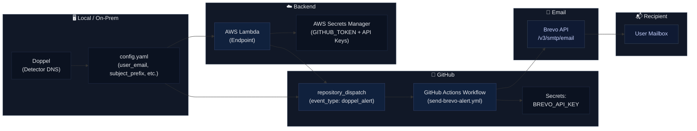

# Doppel

<p align="center">
  
</p>

[]()
[]()

**Doppel** is a Red Team oriented DNS telemetry tool that helps operators detect when Blue Teams, IDS, or IPS systems are performing reverse lookups or other DNS-based reconnaissance on attacker-controlled infrastructure. It centralizes multiple DNS log sources, performs pattern-based detection, and provides reputation enrichment and alerting. When suspicious activity is detected, Doppel automatically triggers an **email notification** to the configured recipient, ensuring operators are immediately informed of reconnaissance attempts in real time.

---

## Features

- ✅ **Real-time DNS monitoring**  
- ✅ **Advanced threat detection with VirusTotal integration**  
- ✅ **Advanced reverse lookup detection with multiple patterns**  
- ✅ **Fake DoH/HTTP server to feed misinformation to IDS/IPS**  
- ✅ **Batch IP reputation checking**  
- ✅ **Support for AWS Route53**

## ✅ Tested with Leading Security Tools

Doppel has been successfully tested in lab environments with several popular IDS/IPS and network security monitoring platforms to validate its detection and evasion capabilities:

- 🛡️ **Strelka**
- 🛡️ **Suricata** 
- 🛡️ **Snort** 
- 🛡️ **Zeek** 

---

## Doppel Setup Guide

### 1. Create directories on your VPS (with ROOT)

```bash
mkdir -p ~/bind9/config
mkdir -p ~/bind9/zones
mkdir -p ~/bind9/logs
```

### 2. Clone the repository

```bash
git clone https://github.com/Acucarinho/Doppel
cd Doppel
```

### 3. Install dependencies

```bash
go mod tidy
```

### 4. Build


```bash
go build -o doppel main.go
```

### 5. Configure Bind9

Create the file `~/bind9/config/named.conf.options` with your preferred editor:

```conf
options {
    directory "/var/cache/bind";

    recursion no;
    allow-query { any; };
    listen-on { any; };
    listen-on-v6 { any; };
    
    querylog yes;
};
```

Create the file `~/bind9/config/named.conf.local` and add:

```conf
zone "darkinfrac2.com" {
    type master;
    file "/etc/bind/zones/db.darkinfrac2.com";
};
```

Replace **darkinfrac2.com** with your domain name.

Create the file `~/bind9/zones/db.darkinfrac2.com` and add:

```dns
$TTL    604800
@       IN      SOA     ns1.darkinfrac2.com. admin.darkinfrac2.com. (
                        1         ; Serial 
                        604800    ; Refresh
                        86400     ; Retry
                        2419200   ; Expire
                        604800 )  ; Negative Cache TTL
;
@       IN      NS      ns1.darkinfrac2.com.
@       IN      NS      ns2.darkinfrac2.com.

; Glue records
ns1     IN      A       203.0.113.10   ; IP of your VPS
@       IN      A       203.0.113.10   ; IP of your VPS
www     IN      A       203.0.113.10   ; IP of your VPS
```

Replace **203.0.113.10** with the public IP of your VPS.

Create the file `~/bind9/config/named.conf` and add:

```conf
include "/etc/bind/named.conf.options";
include "/etc/bind/named.conf.local";
```
### 6. Move the Docker Compose file

```bash
mv ~/Doppel/docker-compose.yml ~/bind9/
```

### 7. Install Docker and start the service

```bash
systemctl start docker
```

### 8. Run with Docker Compose

```bash
cd ~/bind9
docker-compose up -d
```
Check if it’s running:


```bash
docker ps
```

### 9. Domain Configuration

- Log in to your domain registrar panel (GoDaddy, Namecheap, etc.)
- Find the DNS / Nameservers section.
- Replace the current nameservers with the glue records you configured:
  ```text
  ns1.darkinfrac2.com
  ns2.darkinfrac2.com
  ```

## Usage

If you configured the email use:

```bash
./doppel --config config.yaml
```

If you are running Bind9 without docker use

```bash
./doppel --bind9
```

To enable the fake server and provide false information use

```bash
./doppel --config.yaml --doh
```

For debug mode:

```bash
./doppel --config.yaml --debug
```

## Email Alert System in Doppel




## Notes

- **Note:** For Route53 logs, you need to enable Resolver Query Logs and configure an S3 bucket or CloudWatch Logs.

## ⚠️ Why Cloudflare Sucks

At first, I considered using the **Cloudflare API** to fetch DNS logs directly. But here’s the catch: to access raw DNS query logs you need **Logpush**, and that’s only available in their **Enterprise plan**. In other words, you need to pay a premium just to see your own logs.  

Instead of being locked into a vendor paywall, you can achieve the same result for "free". Just deploy **Bind9** (or another DNS server) on your own VPS and configure logging. This gives you full visibility into DNS queries without spending extra money — and you stay in full control of your data.


## Why Go?

I chose Go because I am actively learning the language.

## Inspiration from the Nmap Book

The concept for Doppel was directly inspired by Fyodor’s book Nmap Network Scanning.

> *“One probe commonly initiated by IDSs is reverse DNS query of the attacker’s IP address. A domain name in an alert is more valuable than just an IP address, after all. Unfortunately, attackers who control their own rDNS (quite common) can watch the logs in real time and learn that they have been detected. This is a good time for attackers to feed misinformation, such as bogus names and cache entries to the requesting IDS.”*

## To-Do List

- [ ] Fast-Flux for IP and domain rotation
- [x] Providing false information to the IDS
- [x] Fake DoH/HTTP server for IDSs that use DoH
