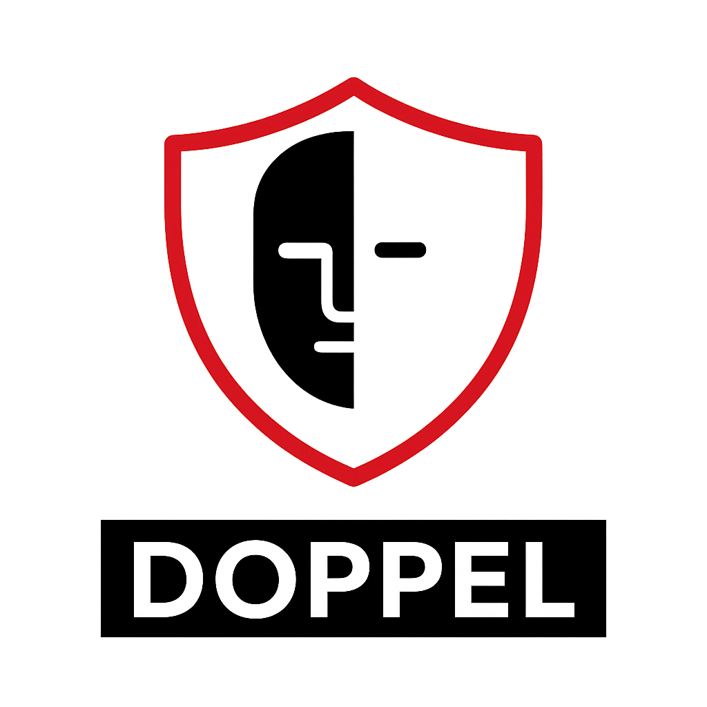

# Doppel

<p align="center">
  
</p>

[]()
[]()

**Doppel** is a Red Team oriented DNS telemetry tool that helps operators detect when Blue Teams, IDS, or IPS systems are performing reverse lookups or other DNS-based reconnaissance on attacker-controlled infrastructure. It centralizes multiple DNS log sources, performs pattern-based detection, and provides reputation enrichment and alerting.

---

# Features

- ✅ **Real-time DNS monitoring**  
- ✅ **Advanced threat detection with VirusTotal integration**  
- ✅ **Advanced reverse lookup detection with multiple patterns**  
- ✅ **IP address extraction and validation**  
- ✅ **Comprehensive tracking of detected IPs**  
- ✅ **Batch IP reputation checking**  
- ✅ **Fast-Flux for IP rotation**  
- ✅ **Support for Cloudflare, AWS Route53 and DigitalOcean**

---

# Doppel Setup Guide

## 1. Create directories on your VPS (with ROOT)

```bash
mkdir -p ~/bind9/config
mkdir -p ~/bind9/zones
mkdir -p ~/bind9/logs
```

## 2. Clone the repository

```bash
git clone https://github.com/Acucarinho/Doppel
cd Doppel
```

## 3. Install dependencies

```bash
go mod tidy
```

## 4. Build


```bash
go build -o doppel main.go
```

## 5. Configure Bind9

Create the file `~/bind9/config/named.conf.options` with your preferred editor:

```conf
options {
    directory "/var/cache/bind";

    recursion no;
    allow-query { any; };
    listen-on { any; };
    listen-on-v6 { any; };
    
    querylog yes;
};
```

Create the file `~/bind9/config/named.conf.local` and add:

```conf
zone "darkinfrac2.com" {
    type master;
    file "/etc/bind/zones/db.darkinfrac2.com";
};
```

Replace **darkinfrac2.com** with your domain name.

Create the file `~/bind9/zones/db.darkinfrac2.com` and add:

```dns
$TTL    604800
@       IN      SOA     ns1.darkinfrac2.com. admin.darkinfrac2.com. (
                        1         ; Serial 
                        604800    ; Refresh
                        86400     ; Retry
                        2419200   ; Expire
                        604800 )  ; Negative Cache TTL
;
@       IN      NS      ns1.darkinfrac2.com.
@       IN      NS      ns2.darkinfrac2.com.

; Glue records
ns1     IN      A       203.0.113.10   ; IP of your VPS
@       IN      A       203.0.113.10   ; IP of your VPS
www     IN      A       203.0.113.10   ; IP of your VPS
```

Replace **203.0.113.10** with the public IP of your VPS.

Create the file `~/bind9/config/named.conf` and add:

```conf
include "/etc/bind/named.conf.options";
include "/etc/bind/named.conf.local";
```
## 6. Move the Docker Compose file

```bash
mv ~/Doppel/docker-compose.yml ~/bind9/
```

## 7. Install Docker and start the service

```bash
systemctl start docker
```

## 8. Run with Docker Compose

```bash
cd ~/bind9
docker-compose up -d
```
Check if it’s running:


```bash
docker ps
```

## 9. Domain Configuration

- Log in to your domain registrar panel (GoDaddy, Namecheap, etc.)
- Find the DNS / Nameservers section.
- Replace the current nameservers with the glue records you configured:
  ```text
  ns1.darkinfrac2.com
  ns2.darkinfrac2.com
  ```

# Usage

If you configured the VirusTotal API or Route53:

```bash
./doppel --config config.yaml
```

For Bind9 logs only:

```bash
./doppel --bind9
```

For debug mode:

```bash
./doppel --debug
```

## Notes

- **Note:** For Route53 logs, you need to enable Resolver Query Logs and configure an S3 bucket or CloudWatch Logs.
